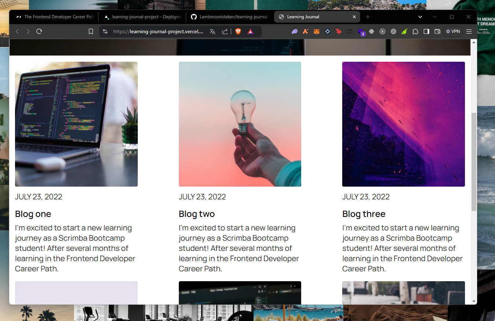

# Learning Journal

This project is a responsive Learning Journal page created as part of an assignment for a Scrimba course. The page serves as a personal blog where the author shares their learning experiences and reflections as they progress through a bootcamp.

## Screenshots

### SS 1


### SS2


### SS3


### SS4


### SS5


## Features

- **Responsive Design**: The page is designed to adapt seamlessly to different screen sizes, ensuring a great user experience on mobile, tablet, and desktop devices.
- **Modern Layout**: Utilizes a grid layout system for the main content and flexbox for the navigation bar, providing a clean and structured design.
- **Custom Styling**: Includes personalized fonts and a stylish color scheme to enhance the readability and visual appeal of the journal entries.
- **Interactive Navigation**: The navigation bar allows easy access to the homepage and an "About Me" section, making the site intuitive and user-friendly.

## Technologies Used

- HTML
- CSS (with media queries for responsiveness)
- CSS GRID
- Google Fonts (Manrope)

## Structure

### HTML

The HTML file includes the following main sections:

1. **Navbar**: A simple navigation bar with links to the homepage and an "About Me" page.
2. **Header**: Features the title of the latest blog post, a summary, and a prominent background image.
3. **Main Content**: A grid of blog post cards, each containing an image, title, date, and a brief excerpt of the content.
4. **Footer**: A footer section that includes the site title and copyright information.

### CSS

The CSS file includes styles for:

- **Typography**: Custom fonts and text styles, ensuring consistency and readability across different devices.
- **Layout**: A responsive grid layout for blog post cards and a flexible navigation bar.
- **Responsive Design**: Media queries that adjust the layout and styling based on the screen size, ensuring the site looks great on all devices by also using css grid.

## Setup and Usage

1. **Clone the repository**:
    ```sh
    git clone https://github.com/lambersonistaken/learning-journal-project.git
    ```

2. **Navigate to the project directory**:
    ```sh
    cd learning-journal-project
    ```

3. **Open `index.html` in your web browser** to view the project.

## License

This project is licensed under the MIT License. See the [LICENSE](./LICENSE) file for more information.

## Acknowledgements

- This project was developed as part of a Scrimba course assignment.
- Background image from Unsplash.
